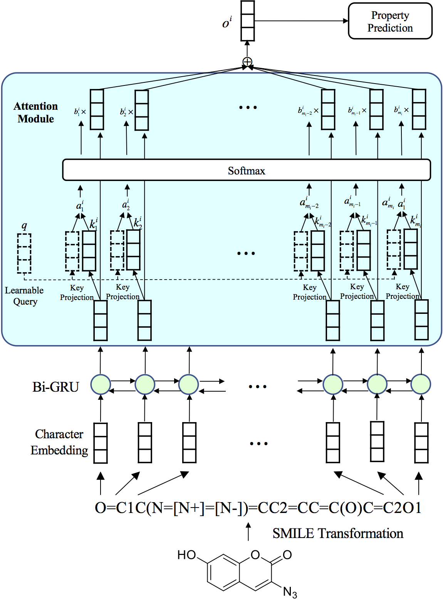

# Attention Based Molecule Property Prediction

Created by [Lei Cai](https://www.eecs.wsu.edu/~lcai/).

## Introduction

We employ Bi-direction GRU and attention module to predict the property of a given molecule. The overal framework can be shown as 




## System requirement

#### Programming language
Python 2.7 +

#### Python Packages
Tensorflow , Numpy

#### Data Formate

The molecule is converted to SMILE string as input for our model.

We release the two datasets for emission and excitation prediction tasks.

emission_input.txt contains SMILE strings to train the model.
emission_output.txt contains the corresponding emission value for the molecule in emission_input.txt

emission_input_test.txt contains SMILE strings to test the model.
emission_output_test.txt contains the corresponding emission value for the molecule in emission_input_test.txt

## Training 

#### Train the network

```
python sensor_train_emission.py --resume False --save_model True --test False
```

#### Predict the property using an existing model

```
python sensor_train_emission.py --resume True --test True --test_path "path to the model"
```

## Model for Prediction

We provide two well trained model for the two tasks.

For emission prediction tasks, the results can be obtained by:

```
python sensor_train_emission.py --resume True --test True --test_path ./work_dir/run1586726418/checkpoints/SensorRNN.ckpt-15
```

For excitation prediction tasks, the results can be obtained by:

```
python sensor_train_excitation.py --resume True --test True --test_path ./work_dir/run1582060157/checkpoints/SensorRNN.ckpt-16
```


## Acknowlegdements

Part of code borrow from https://github.com/snakeztc/NeuralDialog-CVAE. Thanks for their excellent work!
